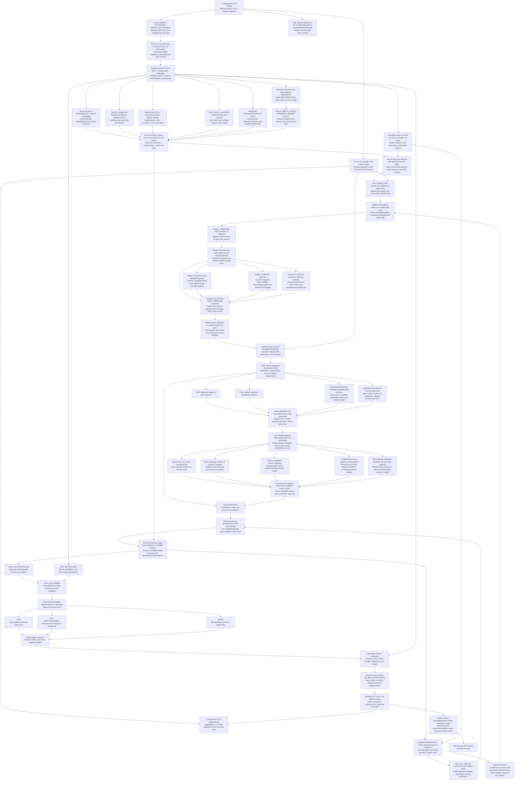

# Long / flat / short workflow - working template

This is a duplicate of the [original workflow chart](my_testing_workflow.md),
with the newly added short side logic in place. 

```mermaid
flowchart TD
    U["15 independent ETF studies<br/>Planned LONG / FLAT / SHORT extension"]
BASE["Frozen v3.1 payoff + ETF-context model<br/>Existing long/cash control and prior OOF forecasts"]    
    D["Source adapters: prices/actions, Refinitiv/LSEG Workspace,<br/>release-aware macro and qualified financial news"]
    C["Preserve raw snapshots; normalize/cache with provenance,<br/>company/provider mapping, timestamps and data versions"]
    Q["Quality and point-in-time gate: coverage, gaps, duplicates,<br/>calendar, actions, revisions and available-at timestamps"]
    FT["Technical library: trend/momentum, reversal, range/gaps,<br/>volume/liquidity, volatility/downside risk and drawdown"]
    FC["Causal changepoints: fast/slow divergence, negative shocks,<br/>volatility jumps and trend acceleration"]
    FR["Relationship factors: market/sector/peers, relative strength,<br/>beta/residuals, rates, currencies and commodities"]
    FM["Macro factors: curve/credit, growth/inflation and surprises<br/>Use historically available releases and vintages"]
    FA["Workspace alternative/fundamental factors:<br/>fundamentals, estimates/revisions and industry relationships"]
    N["Relevant versioned news: entity mapping, deduplication,<br/>publication/update/receipt times, latency and coverage"]
    NB["Pinned FinBERT sentiment probabilities; aggregate balance,<br/>intensity, disagreement, recency and missing-news flags"]
    F["Versioned factor recipes; each stock selects its own subset<br/>Initial four: technical; + relationships; + macro; all three"]
    L["Candidate targets: forward net return or positive net return<br/>5/10/20 sessions; next-open entry; record label maturity"]
    J["Join decision-time features with matured historical labels<br/>Keep entry/end/available-at times; no future outcomes as inputs"]
    G["ests: causality, label maturity and weekly/next-open timing<br/>Signed accounting, short covers and reversal costs"]
    I["INNER chronological research on earlier data only<br/>Purge overlapping labels; fit preprocessing/selection within folds"]
    CART["Stage 1: interpretable CART classifier or regressor<br/>Depth 3; minimum leaf fraction 0.08; seed 42"]
    K["Screen 24 recipes per stock; retain a small declared shortlist<br/>Proposed minimum: 104 matured weekly training rows"]
    RF["Stage 2: Random Forest classifier/regressor<br/>Common ensemble family; stock-specific fit and bounded settings"]
    XGB["Stage 2 challenger: XGBoost classifier/regressor<br/>Same shortlist, chronological dates and declared trial budget"]
    ENS["Optional V2 carryover experiment after the baseline:<br/>compact multi-horizon CART votes, sign agreement and dispersion"]
    V["Compare prior-fold net results, stability and complexity<br/>Retain CART control; deployed learner-family policy stays shared"]
    NEWS["Staged feature ablations on matched dates and costs:<br/>factor groups, then factor-only versus factors plus FinBERT"]
    CAL["Calibrate long and short net payoffs separately<br/>Use prior matured OOF observations and shrinkage"]
    ZF["Fixed magnitude applied to either direction"]
    ZV["Past volatility magnitude multiplied by direction"]
    ZP["Expected-payoff sizing: calibrated probability and gain/loss<br/>Scale with uncertainty; probability alone is not position weight"]
    ZE["Stock plus cash efficient-frontier experiment<br/>Mean-variance utility, risk preference, aligned horizons and costs"]
    ZS["Replay signal/exit and sizing alternatives inside earlier folds<br/>Stage fixed vs vol first; payoff/frontier later; choose before test"]
    A["Later staged adaptive-policy comparisons on earlier folds<br/>Replay delayed feedback; do not search every combination at once"]
    A0["Adaptive control: annual expanding refit<br/>Only outcomes matured by the refit cutoff"]
    A1["Refit challenger: monthly or quarterly schedule<br/>Compare with otherwise identical annual control"]
    A2["Training challenger: recency weighting<br/>Compare with uniform weights; settings chosen earlier"]
    A3["Calibration/trust and adaptive-sizing updates<br/>Stored forecasts plus matured outcomes; shrinkage/minimum samples"]
    A4["Drift-triggered challenger: cooldown and promotion evidence<br/>Drift launches research; it does not automatically replace a model"]
    AV["Compare each adaptive layer with its matched frozen control<br/>Select a declared update policy using prior data only"]
    LOCK["Freeze directional threshholds, sizing, and short risk assumptions"]
    T["Refit the selected specification on prior matured data<br/>Use calibration/update state available at this cutoff"]
    P["OUTER evaluation: apply frozen pipeline to available features<br/>Record immutable weekly forecasts and data/feature/model versions"]
    S["Select the best eligible direction above its threshold<br/>Otherwise choose FLAT"]
    Z["Signed target exposure<br/>Positive LONG, zero FLAT, negative SHORT"]
    B["Next-open account simulation<br/>Turnover costs, borrow charges, distributions and margin"]
    W["Score the outer interval only after outcomes mature<br/>Never select its winner using that interval's realized results"]
    R["Individual ETF report: net Sharpe primary<br/>Equity, drawdown, long/short PnL, exposure and costs"]
    BENCH["Compare each ETF independently<br/>Long/flat/short vs frozen long/cash vs ETF buy-and-hold"]
    REG["Quality reports, candidate/rejection ledger, rules/factor usage,<br/>dated forecasts, positions/cash/NAV, trades, costs and model hashes"]
    M["Delayed feedback queue: match stored forecasts to outcomes<br/>Use only labels matured by the NEXT update cutoff"]
    UP["Next cycle: apply the previously frozen update policy<br/>Refit/calibration changes fitted state, not past predictions"]
    NEW["Optional research reselection at a later cutoff<br/>Target/horizon/factor/sizing recipe changes require a new version"]
    FUTURE["Later optional hypothesis, not an initial dependency:<br/>causal filtered HMM/state features and bounded stress overlay"]
    END["2024-present still remains reserved for OOS"]
    E["Assess the current forecast<br/>Expected net long payoff and net short payoff"]
    SD["Short-side information<br/>Borrow availability, costs and margin assumptions"]
    SG["Check short eligibility<br/>Unavailable borrowing removes the short candidate"]
    SL["LONG<br/>Best qualifying net long opportunity"]
    SF["FLAT<br/>Neither side qualifies, estimates tie or support is insufficient"]
    SS["SHORT<br/>Best qualifying net short opportunity"]
    POL["Define rules using earlier chronological data<br/>Thresholds, neutral region, ties and support requirements"]
    U --> D
    U --> BASE
    U --> FUTURE
    D --> C
    C --> Q
    Q --> FT
    Q --> FC
    Q --> FR
    Q --> FM
    Q --> FA
    Q --> N
    N --> NB
    FT --> F
    FC --> F
    FR --> F
    FM --> F
    FA --> F
    NB --> F
    Q --> L
    F --> J
    L --> J
    J --> G
    BASE --> G
    G --> I
    I --> CART
    CART --> K
    K --> RF
    K --> XGB
    K --> ENS
    K --> V
    RF --> V
    XGB --> V
    ENS --> V
    V --> NEWS
    NEWS --> CAL
    CAL --> POL
    POL --> ZF
    POL --> ZV
    POL --> ZP
    POL --> ZE
    BASE --> CAL
    BASE --> BENCH
    POL --> LOCK
    ZF --> ZS
    ZV --> ZS
    ZP --> ZS
    ZE --> ZS
    ZS --> A
    A --> A0
    A --> A1
    A --> A2
    A --> A3
    A --> A4
    A0 --> AV
    A1 --> AV
    A2 --> AV
    A3 --> AV
    A4 --> AV
    AV --> LOCK
    LOCK --> T
    T --> P
    F --> P
    P --> E
    E --> SG
    Q --> SD
    SD --> SG
    SG --> S
    S --> SL
    S --> SF
    S --> SS
    SL --> Z
    SF --> Z
    SS --> Z
    Z --> B
    Q --> B
    B --> W
    W --> R
    R --> BENCH
    R --> REG
    REG --> M
    P --> M
    L --> M
    M --> UP
    UP --> T
    M --> NEW
    NEW --> I
    REG --> END
```
